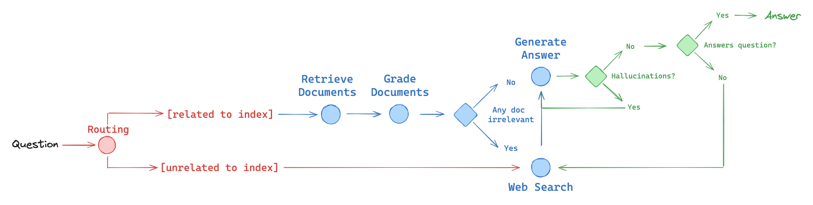
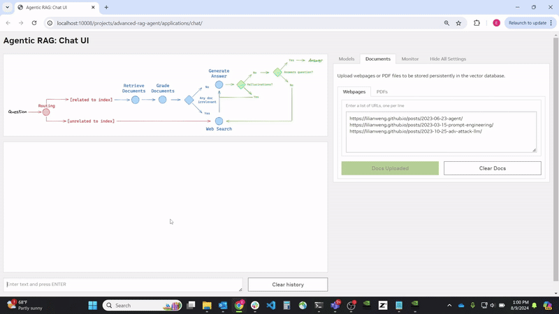
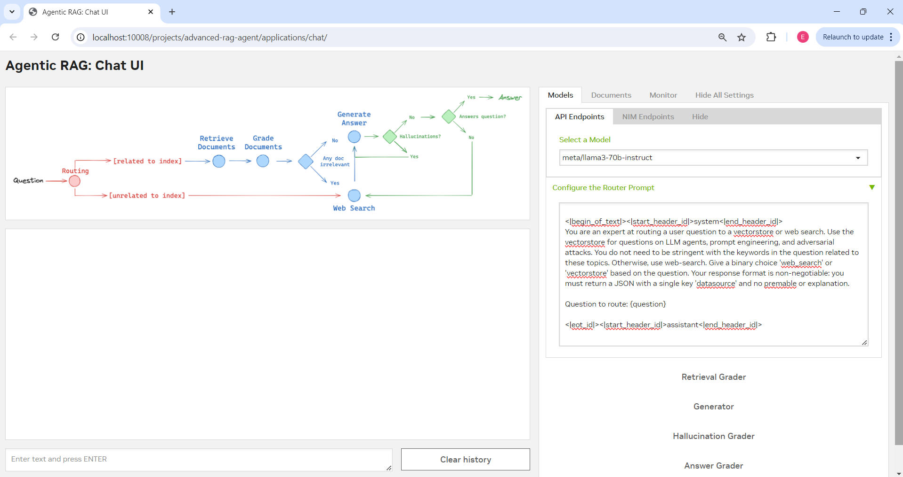
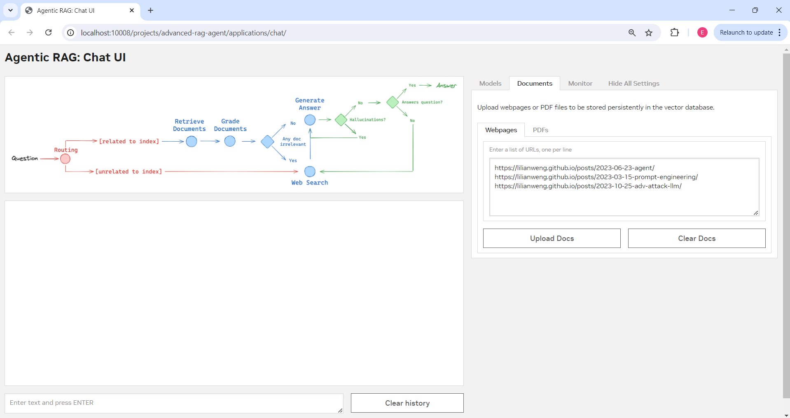
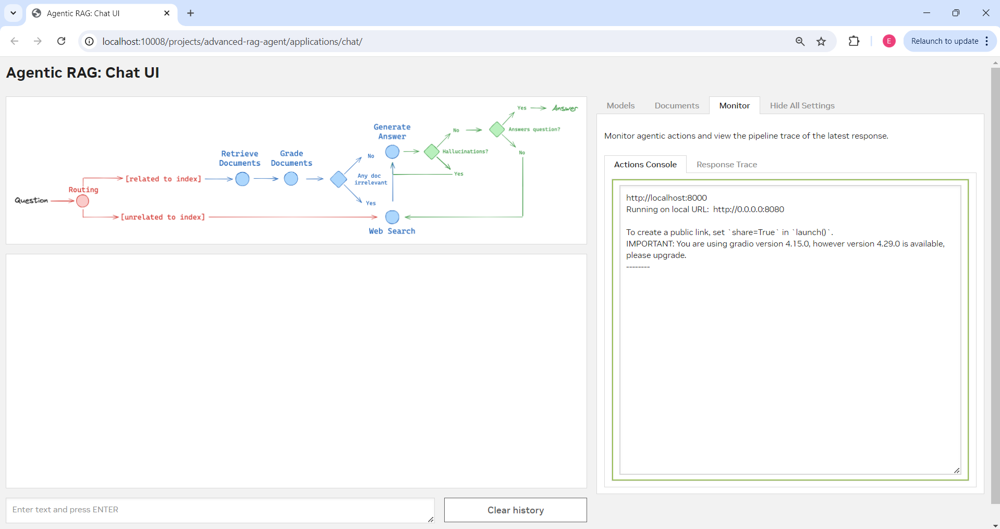

# Table of Contents
* [Introduction](#nvidia-ai-workbench-introduction)
   * [Project Description](#project-description)
     * [Project Deep Dive](#project-deep-dive)
   * [Sizing Guide](#sizing-guide)
* [Quickstart](#quickstart)
   * [Prerequisites](#prerequisites)
   * [Tutorial (Desktop App)](#tutorial-desktop-app)
   * [Tutorial (CLI-Only)](#tutorial-cli-only)
* [License](#license)

# NVIDIA AI Workbench: Introduction

<!-- Banner Image -->


<!-- Links -->
<p align="center"> 
  <a href="https://www.nvidia.com/en-us/deep-learning-ai/solutions/data-science/workbench/" style="color: #76B900;">:arrow_down: Download AI Workbench</a> •
  <a href="https://docs.nvidia.com/ai-workbench/" style="color: #76B900;">:book: Read the Docs</a> •
  <a href="https://docs.nvidia.com/ai-workbench/user-guide/latest/quickstart/example-projects.html" style="color: #76B900;">:open_file_folder: Explore Example Projects</a> •
  <a href="https://forums.developer.nvidia.com/t/support-workbench-example-project-agentic-rag/303414" style="color: #76B900;">:rotating_light: Facing Issues? Let Us Know!</a>
</p>

## Project Description
This is an [NVIDIA AI Workbench](https://www.nvidia.com/en-us/deep-learning-ai/solutions/data-science/workbench/) project for developing a websearch-based [Retrieval Augmented Generation](https://blogs.nvidia.com/blog/what-is-retrieval-augmented-generation/) application with a customizable Gradio Chat app. It lets you:
* Embed your documents in the form of webpages or PDFs into a locally running Chroma vector database.
* Run inference using remotely running endpoints and microservices.
  * Cloud endpoints using the [NVIDIA API Catalog](https://build.nvidia.com/explore/discover)
  * Self-hosted endpoints using [NVIDIA Inference Microservices (NIMs)](https://catalog.ngc.nvidia.com/orgs/nim/teams/meta/containers/llama3-8b-instruct/tags)
  * Third party self-hosted microservices like Ollama.
 


This project uses an agentic workflow depicted in the above diagram to improve response quality in RAG. Using LangGraph, user queries will first be sorted under a RAG or Websearch pipeline depending on an LLM evaluation of the query topic. Depending on its user-configurable prompt, the router LLM can narrow its focus on turning a specific subject or topic routable to the RAG Pipeline. 

<blockquote>
<details>
<summary>
<b>Expand this section for a description of RAG Pipeline.</b>
</summary>

Under the retrieval pipeline, the user query is first compared to documents in the vector database and the most relevant documents are retrieved. 

Another LLM call evaluates the quality of the documents. If satisfactory, it proceeds to the generation phase to produce an response augmented by this relevant context. If the agent decides the best documents are irrelevant to the query, it redirects the user query to the websearch pipeline for a better quality response (see below section). 

After generation, another set of LLMs calls evaluate the response for hallucinations and accuracy. If the generation is both faithful to the retrieved context and answers the user's query in a satisfactory manner, the response is forwarded to the user and displayed. Otherwise, the agent will either regenerate the response, or redirect the query to a web search. 

</details>

<details>
<summary>
<b>Expand this section for a description of Websearch Pipeline.</b>
</summary>

Under the web search pipeline, the user query is inputted onto the web and the search results are retrieved. Using these results, a response is generated. 

After generation, a set of LLMs calls evaluate the response for hallucinations and accuracy. If the generation is both faithful to the retrieved context and answers the user's query in a satisfactory manner, the response is forwarded to the user and displayed. Otherwise, the agent will either regenerate the response, or redirect the query to another web search. 

</details>
</blockquote>

| :memo: Remember             |
| :---------------------------|
| This project is meant as an example workflow and a starting point; you are free to add new models, rearrange the interface, or edit the source code as you see fit for your particular use case! |

### Project Deep Dive

<details>
<summary>
<b>Expand this section for a full guide of the user-configurable project settings</b>
</summary>



When the user lands on the Chat UI application in the browser, they will see several components. On the left hand side is a standard chatbot user interface with a user input for queries (submittable with ``[ENTER]``) and a clear history button. Above this chatbot is a diagram of the agentic RAG pipeline which doubles as a progress bar indicator for any nontrivial user actions a user might take, like uploading a document. 

On the right hand side, users will see a collapsable settings panel with several tabs they may choose to navigate to and configure. 

<blockquote>
<details>
<summary>
<b>Expand for Model Settings.</b>
</summary>



This tab holds every user-configurable setting for each of the LLM components of the agentic RAG pipeline: 

* Router
* Retrieval Grader
* Generator
* Hallucination Grader
* Answer Grader

Expanding any such entry will yield a panel where users can specify the model they would like to use for that particular component from a dropdown (using NVIDIA API Catalog endpoints), or they can specify their own remotely running self-hosted NVIDIA NIM custom endpoint.

Below this field is an expandable accordion where users can adjust the default prompts for that particular component's task. For example, under the Router component, users can re-write and customize their prompt to focus on only routing queries relating to LLMs and agents to the RAG pipeline and directing all other queries to the Websearch pipeline. 

</details>

<details>
<summary>
<b>Expand for Document Settings.</b>
</summary>



This tab holds every user-configurable setting for the vector database and document ingestion aspects of this agentic RAG pipeline. Users can upload their own webpages to the vector database by entering a newline-seperated list of URLs in the textbox and clicking Upload, or they can upload their own PDF files from their local machine to be stored in the vector datastore. 

</details>


<details>
<summary>
<b>Expand for Monitoring Settings.</b>
</summary>



This tab holds the agentic RAG monitoring tools built into this application. 

* The first tool is a console that logs all the actions the agent has decided to take when processing the user query and provides a general overview into the agent's decision making.
* The second tool is an in-depth trace of the agent's actions for the last submitted query, which gives more detail into the context retrieved, websearch documents found, LLM pipeline components used, etc. when generating out the most recent response. 

</details>
</blockquote>

</details>

## Sizing Guide

| GPU VRAM | Example Hardware | Compatible? |
| -------- | ------- | ------- |
| <16 GB | RTX 3080, RTX 3500 Ada | Y |
| 16 GB | RTX 4080 16GB, RTX A4000 | Y |
| 24 GB | RTX 3090/4090, RTX A5000/5500, A10/30 | Y |
| 32 GB | RTX 5000 Ada  | Y |
| 40 GB | A100-40GB | Y |
| 48 GB | RTX 6000 Ada, L40/L40S, A40 | Y |
| 80 GB | A100-80GB | Y |
| >80 GB | 8x A100-80GB | Y |

# Quickstart

## Prerequisites
AI Workbench will prompt you to provide a few pieces of information before running any apps in this project. Ensure you have this information ready. 
   
   * An NVIDIA API Key. You can generate one under ``Get API Key`` on any API Catalog [model card](https://build.nvidia.com/mistralai/mistral-7b-instruct-v2)
   * A Tavily Search API Key. You can generate one under a free account (1000 searches/month) [here](https://app.tavily.com/home).

## Tutorial (Desktop App)

If you do not NVIDIA AI Workbench installed, first complete the installation for AI Workbench [here](https://www.nvidia.com/en-us/deep-learning-ai/solutions/data-science/workbench/). Then, 

1. Fork this Project to your own GitHub namespace and copy the link

   ```
   https://github.com/[your_namespace]/<project_name>
   ```
   
2. Open NVIDIA AI Workbench. Select a location to work in. 
   
3. Clone this Project onto your desired machine by selecting **Clone Project** and providing the GitHub link.
   
4. Wait for the project to build. You can expand the bottom **Building** indicator to view real-time build logs. 
   
5. When the build completes, set the following configurations.

   * `Environment` &rarr; `Secrets` &rarr; `Configure`. Specify the NVIDIA API Key and Tavily Search Key as project secrets.

6. On the top right of the window, select **Jupyterlab**. 

7. Navigate to the `code` directory of the project. Then, open your fine-tuning notebook and get started. Happy coding!

## Tutorial (CLI-Only)
Some users may choose to use the **CLI tool only** instead of the Desktop App. If you do not NVIDIA AI Workbench installed, first complete the installation for AI Workbench [here](https://www.nvidia.com/en-us/deep-learning-ai/solutions/data-science/workbench/). Then, 
1. Fork this Project to your own GitHub namespace and copying the link

   ```
   https://github.com/[your_namespace]/<project_name>
   ```
   
2. Open a shell and activating the Context you want to clone into by

   ```
   $ nvwb list contexts
   
   $ nvwb activate <desired_context>
   ```

   | :bulb: Tip                  |
   | :---------------------------|
   | Use ```nvwb help``` to see a full list of  AI Workbench commands. |
   
3. Clone this Project onto your desired machine by running

   ```
   $ nvwb clone project <your_project_link>
   ```
   
4. Open the Project by

   ```
   $ nvwb list projects
   
   $ nvwb open <project_name>
   ```

5. Start **Jupyterlab** by

   ```
   $ nvwb start jupyterlab
   ```

   * Specify the NVIDIA API Key and Tavily Search Key as project secrets.

6. Navigate to the `code` directory of the project. Then, open your fine-tuning notebook and get started. Happy coding!

# License
This NVIDIA AI Workbench example project is under the [Apache 2.0 License](https://github.com/NVIDIA/workbench-example-agentic-rag/blob/main/LICENSE.txt)

This project may utilize additional third-party open source software projects. Review the license terms of these open source projects before use. Third party components used as part of this project are subject to their separate legal notices or terms that accompany the components. You are responsible for confirming compliance with third-party component license terms and requirements. 

| :question: Have Questions?  |
| :---------------------------|
| Please direct any issues, fixes, suggestions, and discussion on this project to the DevZone Members Only Forum thread [here](https://forums.developer.nvidia.com/t/support-workbench-example-project-agentic-rag/303414) |
