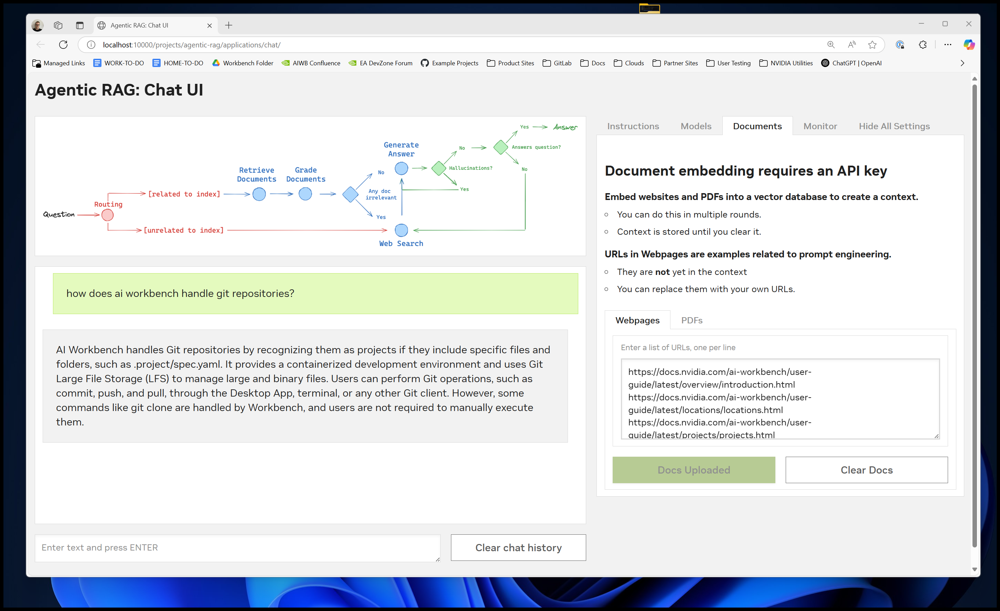
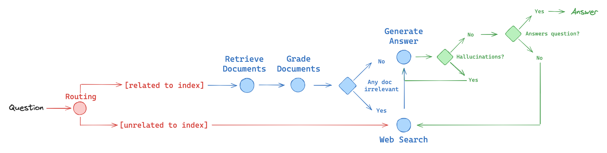

# Agentic RAG - Idea to answers in minutes

#### Boost RAG with an agentic layer that:
- routes queries and adds live web search context is thin
- grades responses for relevance and accuracy, flags hallucinations
- lets you edit prompts for every stage from the UI

#### Run inference your way:
- **Free out-of-the-box**: use free endpoints on build.nvidia.com
- **Self-hosted**: Point to NIM or other models on your own GPUs

#### Make the application your own:
- Switch models and settings in the UI
- [Fork](https://docs.github.com/en/pull-requests/collaborating-with-pull-requests/working-with-forks/fork-a-repo#forking-a-repository) to customize and share changes
 

## Get Started 

#### This app runs in [NVIDIA AI Workbench](https://docs.nvidia.com/ai-workbench/user-guide/latest/overview/introduction.html), a free developer platform with a cloud-like UX locally - No cloud needed.

### 5 minutes or less (Workbench already installed)
1. Grab two keys:  
   - ``NVIDIA_API_KEY`` → [Generate](https://org.ngc.nvidia.com/setup/api-keys)  
   - ``TAVILY_API_KEY`` → [Generate](https://tavily.com)  
2. In AI Workbench, clone this repo and paste the keys when prompted.  
3. Click **Open Chat**, upload docs or URLs for context.  
4. Ask your first question - the answers come from free cloud endpoints.

### Or, spend a little more time and use self-hosted GPUs
1. Set up a Linux box with an NVIDIA GPU and Docker.  
2. Deploy an **NVIDIA NIM** container on that host.  
3. Configure the chat app to use the NIM.

See [step-by-step instructions here](agentic-rag-docs/self-host.md)

*Navigating the README:* [Application Overview](#the-agentic-rag-application) | [Get Started](#get-started) | [Deep Dive](#deep-dive-on-self-hosted-endpoints) | [License](#license)

<!-- Links -->
*Other Resources:* [:arrow_down: Download AI Workbench](https://www.nvidia.com/en-us/deep-learning-ai/solutions/data-science/workbench/) | [:book: User Guide](https://docs.nvidia.com/ai-workbench/) |[:open_file_folder: Other Projects](https://docs.nvidia.com/ai-workbench/user-guide/latest/quickstart/example-projects.html) | [:rotating_light: User Forum](https://forums.developer.nvidia.com/t/support-workbench-example-project-agentic-rag/303414)

## Need, Don't Need and Nice to Have

- **Need**: Internet access while running the chat app and two API keys and [NVIDIA API key](https://org.ngc.nvidia.com/setup/api-keys))
- **Don't Need**: Local GPU
- **Nice to Have**: Remote GPU system if you want to self-host a NIM endpoint

## The Agentic RAG Application
#### Using the Application

1. **Clone** the project with AI Workbench, **configure** the relevant API keys, and **start** the chat app
2. **Configure** the separate model components for agent
3. **Add** your documents to the context (vector db) 
4. **Make** a query.
5. **Agent returns** an answer vetted for relevance, accuracy and hallucination. 

 

#### Modifying the Application

* **Within the app you can**:
   * Change the prompts for the different components, e.g. the hallucination grader.
   * Change the webpages and pdfs you want to use for the context in the RAG.
   * Select different endpoints from [build.nvidia.com](https://build.nvidia.com/explore/discover) for the inference components.
   * Configure it to use self-hosted endpoints with [NVIDIA Inference Microservices (NIMs)](https://catalog.ngc.nvidia.com/orgs/nim/teams/meta/containers/llama3-8b-instruct/tags) or [Ollama](https://hub.docker.com/r/ollama/ollama).
* **Within the code you can**:
   * Add new endpoints and endpoint providers
   * Change the Gradio interface or the application structure and logic.

> **Note** Setting up self-hosted endpoints is relatively advanced because you will need to do it manually. 

## Get Started

#### Prerequisites 

1. Install [AI Workbench](https://docs.nvidia.com/ai-workbench/user-guide/latest/installation/overview.html).

2. Get an NVIDIA Developer Account and an API key.
   * Go to [build.nvidia.com](https://build.nvidia.com/) and click `Login`.
   * Create account, verify email.
   * Create a Cloud Account.
   * Click your initial > `API Keys`.
   * Create and save your key because you may need it for other projects.

3. Get a Tavily account and an API key.
   * Go to [Tavily](https://tavily.com/) and create an account.
   * Create an API key on the overview page.
     
4. Configure the NVIDIA and Tavily API keys as [secret environment variables in Workbench](https://docs.nvidia.com/ai-workbench/user-guide/latest/environment/variables.html#basic-usage-for-environment-variables)

> **Note**: NVIDIA Employees: Configure the `INTERNAL_API` environment variable to use endpoints.

### Start the Chat
   
1. Open NVIDIA AI Workbench. Select a [location to work in](https://docs.nvidia.com/ai-workbench/user-guide/latest/locations/locations.html).
   
2. Use the repository URL to clone this project with AI Workbench and wait for it to build.
   
3. Add your NVIDIA API key and the Tavily API key when prompted.

4. Open the **Chat** from Workbench. It should automatically open in a new browser tab.

5. Upload your documents and change the Router prompt to focus on your uploaded documents. 

6. Start chatting.

## Deep Dive on Self-Hosted Endpoints

> **Note** This assumes you've done the "Get Started" steps.

#### Using Self-Hosted Endpoints

You can configure pipeline components (Router, Generator, Retrieval, Hallucination Check, Answer Check) separately to use either an endpoint or a self-hosted NIM, as well as selecting different models. In otherwords, you can mix and match between hosted and self-hosted components based on your needs. The application includes built-in GPU compatibility checking **for the remote host GPUs** to help you select appropriate models for that hardware configuration.

Prerequisites for the remote GPU:
* NVIDIA GPU(s) with appropriate VRAM
* Ubuntu 22.04 or later with latest NVIDIA drivers
* Docker and NVIDIA Container Toolkit

To set up NIM endpoints for your components:
1. Check the [NIM documentation](https://docs.nvidia.com/nim/large-language-models/latest/getting-started.html) for detailed setup instructions
2. For each component you want to self-host:
   * Select "NIM Endpoints" in the component's configuration
   * Choose your GPU type and count - the UI will automatically show only compatible models
   * Enter your endpoint details (host, port)
3. Components not set to self-hosted will continue using their configured cloud endpoints

The application will validate your GPU configuration for each component and prevent incompatible model selections. You can use different GPU configurations for different components based on their computational needs.

# License
This NVIDIA AI Workbench example project is under the [Apache 2.0 License](https://github.com/NVIDIA/workbench-example-agentic-rag/blob/main/LICENSE.txt)

This project may utilize additional third-party open source software projects. Review the license terms of these open source projects before use. Third party components used as part of this project are subject to their separate legal notices or terms that accompany the components. You are responsible for confirming compliance with third-party component license terms and requirements. 

| :question: Have Questions?  |
| :---------------------------|
| Please direct any issues, fixes, suggestions, and discussion on this project to the DevZone Members Only Forum thread [here](https://forums.developer.nvidia.com/t/support-workbench-example-project-agentic-rag/303414) |
