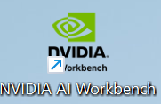
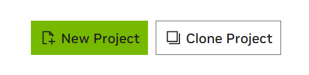
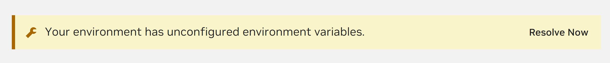
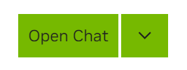
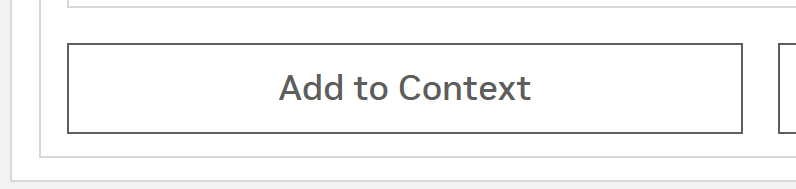
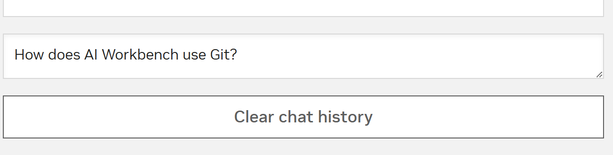

*Navigating the README:* [Get Started](#get-started) | [Easy Mode Details](#easy-mode-details) | [Advanced Mode Details](#advanced-mode-details) | [Repository License](#license)

<!-- Links -->
*Other Resources:* [:arrow_down: Download AI Workbench](https://www.nvidia.com/en-us/deep-learning-ai/solutions/data-science/workbench/) | [:book: User Guide](https://docs.nvidia.com/ai-workbench/) |[:open_file_folder: Other Projects](https://docs.nvidia.com/ai-workbench/user-guide/latest/quickstart/example-projects.html) | [:rotating_light: User Forum](https://forums.developer.nvidia.com/t/support-workbench-example-project-agentic-rag/303414)

# Agentic RAG - Control for accuracy and hallucination

### Boost RAG with an agentic layer that:
- **Routes**: Checks the RAG context for relevance to the query and adds live web search if the context is thin
- **Evaluates**: Checks responses for relevance and accuracy, flags hallucinations
- **Iterates**: Goes through multiple evaluation and generation cycles
- **Customizes** Lets you you edit prompts for each piece of the pipeline

### Run inference your way:
- **Free out-of-the-box**: use free endpoints on build.nvidia.com
- **Self-hosted**: Point to NIM or other models on your own GPUs

## Get Started 

### Prerequisites - AI Workbench and an Internet Connection
This app is built to run in [NVIDIA AI Workbench](https://www.nvidia.com/en-us/deep-learning-ai/solutions/data-science/workbench/), a free, cloud-like UX for your own systems.
You can run the app without Workbench, but to follow this readme, you need [AI Workbench](https://docs.nvidia.com/ai-workbench/user-guide/latest/installation/overview.html) installed on your laptop.

> You **must** be connected to the internet to **run** the application because it uses an NVIDIA endpoint for the context creation.

### Easy Mode (< 5 minutes if Workbench installed)

1. Get NVIDIA and Tavily API keys:  
   - ``NVIDIA_API_KEY`` → [Generate](https://org.ngc.nvidia.com/setup/api-keys)  See instructions [here](https://docs.nvidia.com/ai-enterprise/deployment/spark-rapids-accelerator/latest/appendix-ngc.html).
   - ``TAVILY_API_KEY`` → [Generate](https://tavily.com)  
2. **Clone** this repo with AI Workbench > [configure the keys](https://docs.nvidia.com/ai-workbench/user-guide/latest/environment/variables.html#basic-usage-for-environment-variables) when prompted.  
3. Click **Open Chat** > Go to the **Document** tab in the web app > Click **Add to Context**.  
4. Type in your question > Hit enter--answers come from free cloud endpoints.

### Intermediate Mode (modify agent and UI code)

See [full instructions here](agentic-rag-docs/edit-code.md).

1. [Fork](https://docs.github.com/en/pull-requests/collaborating-with-pull-requests/working-with-forks/fork-a-repo#forking-a-repository) this project to your own GitHub account. Then clone it in Workbench
2. [Add VS Code to the project](https://docs.nvidia.com/ai-workbench/user-guide/latest/applications/vs-code.html)
3. Create an ``experiment`` branch to protect main
4. Open VS Code from the Desktop App and edit the application code

### Advanced Mode (self-host GPUs)
See [full instructions here](agentic-rag-docs/self-host.md).
1. Set up a Linux box with an NVIDIA GPU and Docker.  
2. Deploy an **NVIDIA NIM** container on that host.  
3. Configure the chat app to use the NIM.

## Easy Mode Details 
Follow these steps if you want to get up and running but don't care about modifying the application or adding your own endpoints.

### Clone this project > Start the chat >  Create the context >  Ask your questions

| Steps | Screenshot | What can go wrong |
|------|------------|-------------------|
| 1. Open the Desktop App > Select [local](https://docs.nvidia.com/ai-workbench/user-guide/latest/locations/locations.html). | 

 | Probably a  Docker Desktop issue (if selected on install). **Fix**:  See [troubleshooting here](https://docs.nvidia.com/ai-workbench/user-guide/latest/troubleshooting/troubleshooting.html) | 
| 2. Click **Clone Project** > Paste repository [URL](https://github.com/NVIDIA/workbench-example-agentic-rag) > **Clone** |  | Incorrect URL. **Fix**: use the correct URL. | 
| 3. Click **Resolve Now** > Enter NVIDIA and Tavily API keys. |  | You don't see the banner. **Fix**: go to **Project Container > Variables > Configure** for API keys. See [docs here](https://docs.nvidia.com/ai-workbench/user-guide/latest/environment/variables.html) | 
| 4. Click **Open Chat**. |  | Very little can go wrong here |
| 5. Click **Documents > Create Context**. |  | Incorrect API key. Fix per Step 3 above. | 
| 6. Type question > Hit  enter. |  | Incorrect API key. Fix per Step 3 above. | 

### Clear context > Change URLs > Create context > Ask your questions

Use these steps when you want to work with your own documents and your own prompts.

| Steps | What happens | What can go wrong | 
|------|--------------|-------------------|
| 1. Click **Documents > Clear Context**. | Vector DB reset. | Very little.
| 2. Delete the URLs > Add your own > Click **Add to Context**. | New context. |  URLs that can't be resolved. **Fix**: Enter appropriate URLs | 
| 3. Type question > Hit enter. | Triggers the agent. | Incorrect API key. **Fix**: Fix per Step 3 in table above. | 

### (optional) Change prompts
You can significantly modify the behavior of the agent by changing the prompts.

## Intermediate Mode Details
This application is just a starting point, so you can do whatever you want. As such, there are too many things to go through in detail. Furthermore, 
it's a quick prototype and not a fully robust piece of software. So there are **many** opportunities for you to improve it.

### See [full instructions here](agentic-rag-docs/edit-code.md).

You can:
- Change various parameters such as recursion limit, number of web sites returned by a Tavily search, and whether previous searches are saved
- Add different models by adding in new endpoints from build.nvidia.com
- Change the look and feel of the Gradio app or add new features
- Modify the agent itself
- Fix any bugs you find

## Advanced Mode Details

Use these details if you want to modify the application, e.g. by configuring prompts, adding your own endpoints, changing the Gradio app or whatever else occurs to you.

### Fork this repo > Clone it in Workbench 
This repository is read-only, so if you want to customize this app and share the changes, then you should this repository before you clone it. 

#### Using Self-Hosted Endpoints

You can configure pipeline components (Router, Generator, Retrieval, Hallucination Check, Answer Check) separately to use either an endpoint or a self-hosted NIM, as well as selecting different models. In otherwords, you can mix and match between hosted and self-hosted components based on your needs. The application includes built-in GPU compatibility checking **for the remote host GPUs** to help you select appropriate models for that hardware configuration.

Prerequisites for the remote GPU:
* NVIDIA GPU(s) with appropriate VRAM
* Ubuntu 22.04 or later with latest NVIDIA drivers
* Docker and NVIDIA Container Toolkit

To set up NIM endpoints for your components:
1. Check the [NIM documentation](https://docs.nvidia.com/nim/large-language-models/latest/getting-started.html) for detailed setup instructions
2. For each component you want to self-host:
   * Select "NIM Endpoints" in the component's configuration
   * Choose your GPU type and count - the UI will automatically show only compatible models
   * Enter your endpoint details (host, port)
3. Components not set to self-hosted will continue using their configured cloud endpoints

The application will validate your GPU configuration for each component and prevent incompatible model selections. You can use different GPU configurations for different components based on their computational needs.

# License
This NVIDIA AI Workbench example project is under the [Apache 2.0 License](https://github.com/NVIDIA/workbench-example-agentic-rag/blob/main/LICENSE.txt)

This project may utilize additional third-party open source software projects. Review the license terms of these open source projects before use. Third party components used as part of this project are subject to their separate legal notices or terms that accompany the components. You are responsible for confirming compliance with third-party component license terms and requirements. 

| :question: Have Questions?  |
| :---------------------------|
| Please direct any issues, fixes, suggestions, and discussion on this project to the DevZone Members Only Forum thread [here](https://forums.developer.nvidia.com/t/support-workbench-example-project-agentic-rag/303414) |
